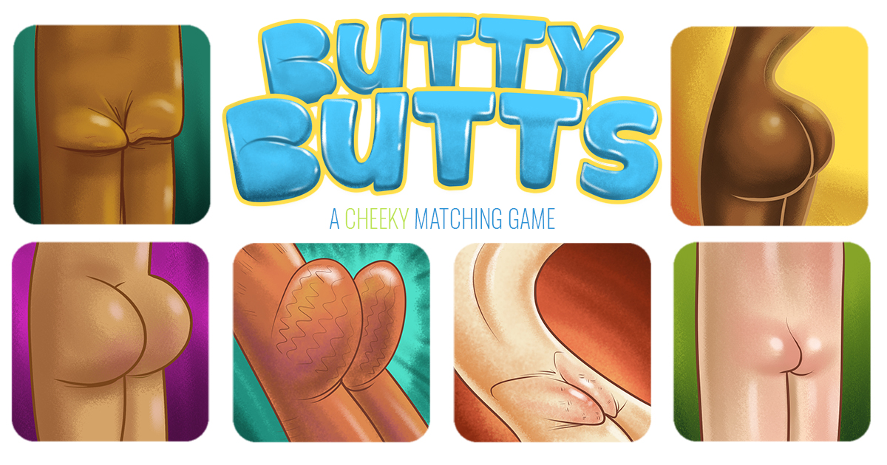

### Project Link

`Link:` https://flip-hart.netlify.app/

## Project Goals

1.  **Working with Recoil State**

    I just started working with Recoil's state management and I wanted to get a slightly better handle on it.

2.  **Animation Packages**

    One of the things I've tried to get better about is finding the answers I need instead of trying to write every piece of code myself. I wanted to pull in npm packges and get used to working that way.

3.  **Theming**

    I was mainly looking to make something fun and silly and when my fiancee suggested butts I was like "that's that". After posting the first version on my Facebook, one of my friend's daughters was apparently calling it "Butty Butts" and that just felt like the exact amount of maturity the name of this project required.
